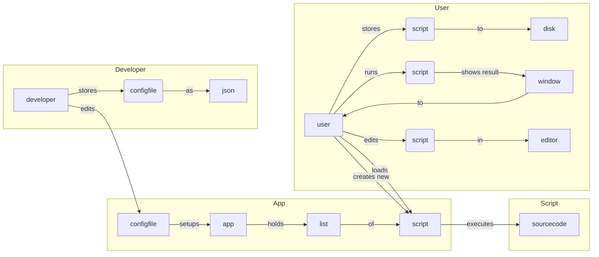

# Pylaunch

```mermaid
graph LR
	subgraph App
        app -- holds --> list -- of --> script
        configfile -- setups --> app
	end
	subgraph User
        user -- stores --> s1("script") -- to --> disk
        user -- loads --> script
        user -- runs --> s2("script") -- shows result --> window -- to --> user
        user -- creates new --> script
        user -- edits --> s3("script") -- in --> editor
	end
	subgraph Developer
        developer -- edits --> configfile
        developer -- stores --> cf1("configfile") -- as --> json
	end
	subgraph Script
		script -- executes --> sourcecode
	end
```
