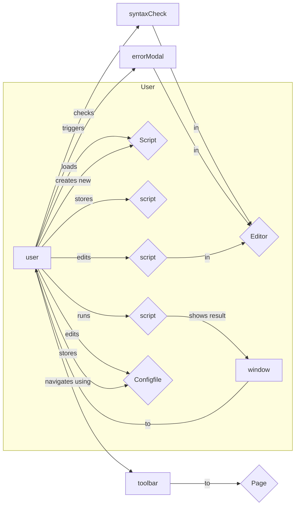
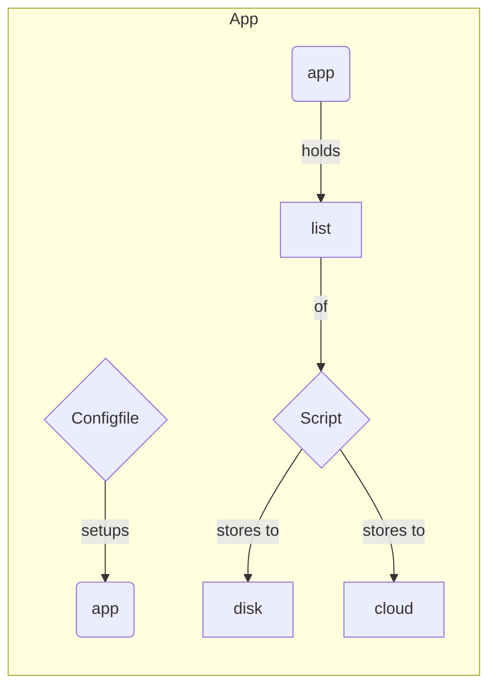
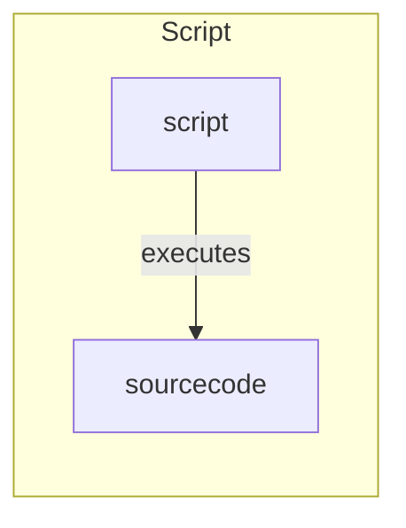
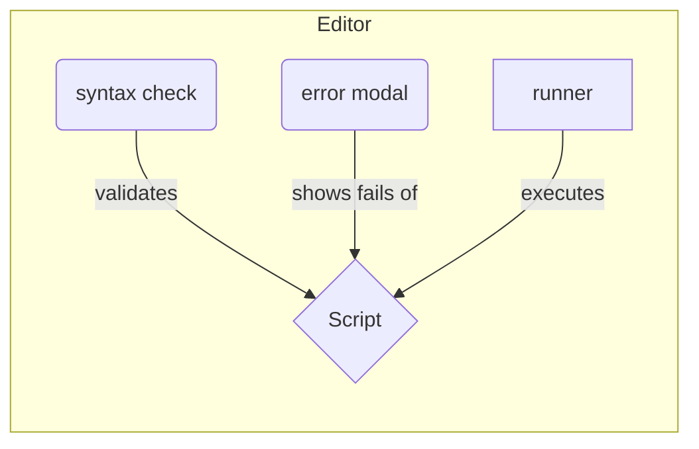
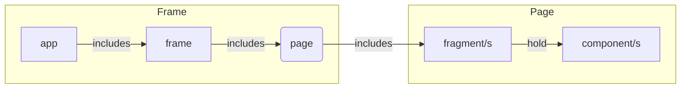
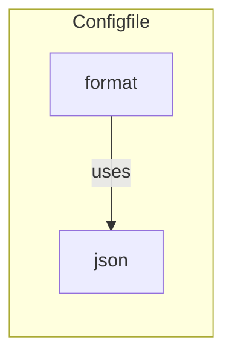
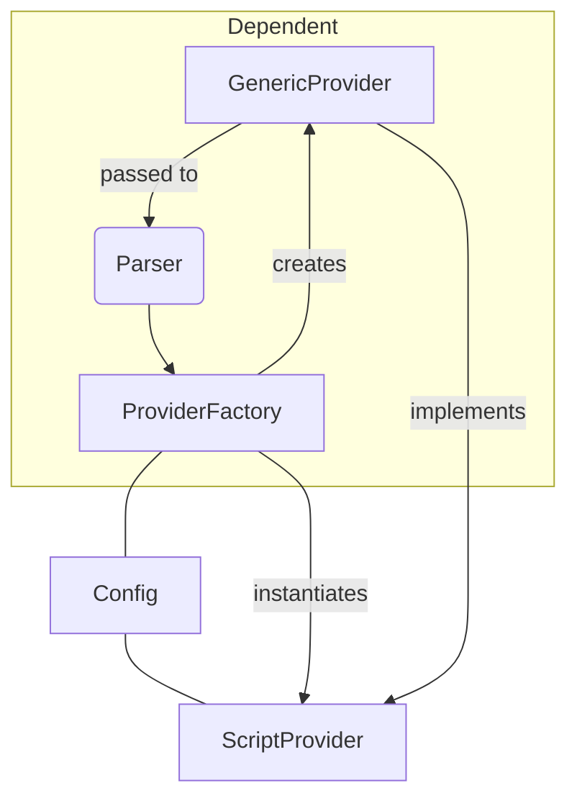

# Pylaunch

## Domain Views

---

### User Stories

As a User I want to edit python scripts to modify my source code and be able to program.
As a User I want to execute my python scripts to automate and interact with other programs and simplify everyday tasks.
As a User I want to store (disk) / download (cloud) my scripts to have them available at all times.
As a User, I would like to update the program to stay up to date and get the latest features.

---














## Technical Views

````mermaid
graph TD
	bf --> bb --> bf
	eb --- ef
	state -- used by --> components
	components -- store global data into --> state
	
	subgraph Frontend
		ef("eel")
		bf("bridge")
		components
	end

	subgraph Backend
		eb("eel")
		bb("bridge")
	end
	
	subgraph Store
		state
	end
````

#### Script Provider current state



## Project Assets

#### Links

https://coolors.co/1500ff-007bff-00eeff-00ffcb-00ff5d