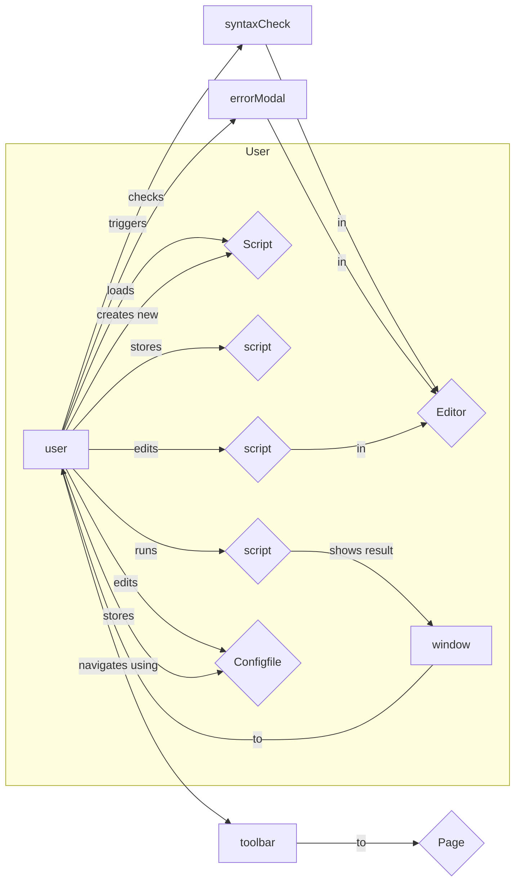
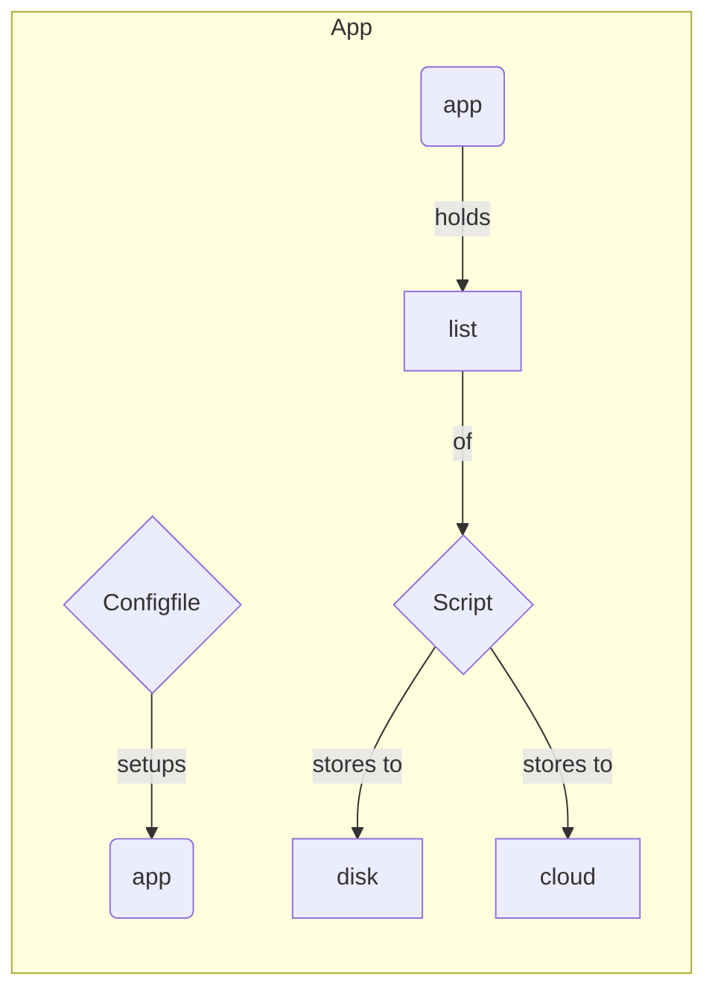
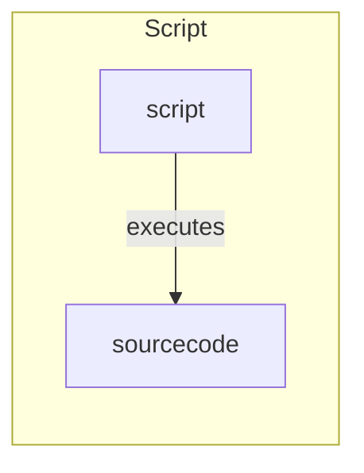
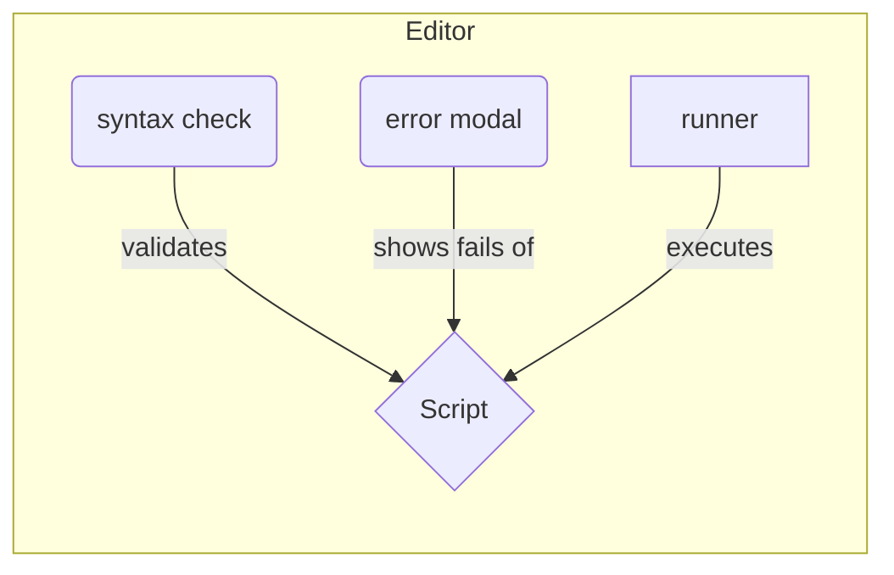
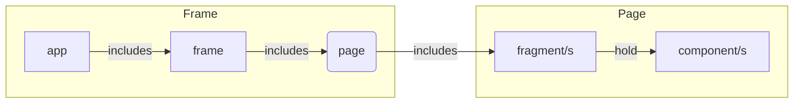
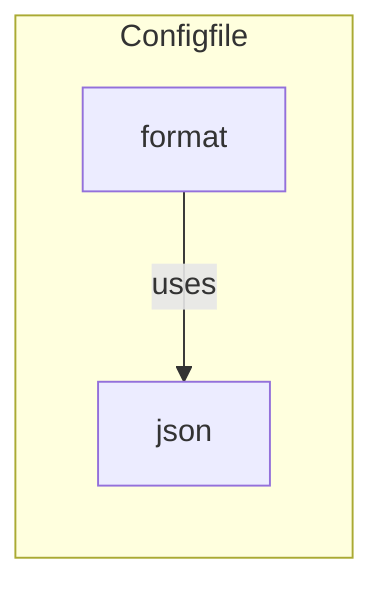

# Pylaunch

## Domain Views



As an User I want to edit python scripts to modify their source code.
As an User I want to execute my python scripts to automate and interact with my programs.
As an User I want to store (disk) and download (cloud) my scripts anytime without hassle.
As an User I want to update the program without thinking about it.












## Technical Views

````mermaid
graph TD
	bf --> bb --> bf
	eb --- ef
	state -- used by --> components
	components -- store global data into --> state
	
	subgraph Frontend
		ef("eel")
		bf("bridge")
		components
	end

	subgraph Backend
		eb("eel")
		bb("bridge")
	end
	
	subgraph Store
		state
	end
````

## Project Assets

#### Links

https://coolors.co/1500ff-007bff-00eeff-00ffcb-00ff5d